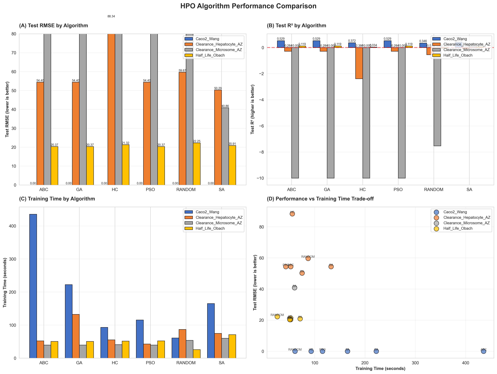
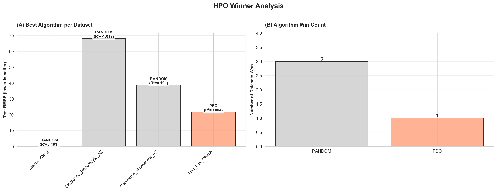
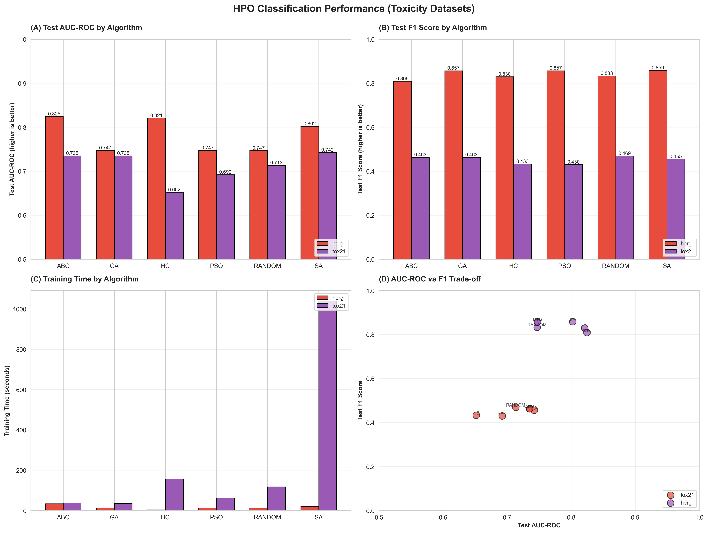

# MANU - Systematic HPO Benchmark for Molecular GNNs

**Systematic Hyperparameter Optimization for Molecular Property Prediction with Graph Neural Networks**

[](https://www.python.org/downloads/)
[](https://pytorch.org/)
[](LICENSE)

---

## Overview

A comprehensive benchmark comparing six metaheuristic HPO algorithms for GNN-based ADMET property prediction across six datasets from the Therapeutics Data Commons (TDC).

### Key Statistics

| Metric | Value |
|--------|-------|
| **Datasets** | 6 (4 ADME + 2 Toxicity) |
| **Total Molecules** | 11,805 |
| **HPO Algorithms** | 6 (Random, PSO, ABC, GA, SA, HC) |
| **Trials per Run** | 50 |
| **Total HPO Runs** | 36 |
| **Total Model Evaluations** | 1,800 |
| **Compute Time** | ~33 hours |

---

## Key Findings

1. **Random Search is sufficient for regression tasks** - Wins on 3/4 ADME datasets
2. **Metaheuristic algorithms excel on classification** - SA wins on Tox21, ABC wins on hERG
3. **No universal winner** - Algorithm selection should be task-dependent
4. **50 trials is sufficient** - Diminishing returns beyond this budget

---

## Results (50 Trials)

### ADME Regression

| Dataset | Winner | Test RMSE | Test R² |
|---------|--------|-----------|---------|
| Caco2_Wang | **RANDOM** | 0.0027 | 0.482 |
| Half_Life_Obach | **PSO** | 21.66 | 0.004 |
| Clearance_Hepatocyte | **RANDOM** | 68.22 | -1.019 |
| Clearance_Microsome | **RANDOM** | 38.75 | 0.191 |

### Toxicity Classification

| Dataset | Winner | Test AUC-ROC | Test F1 |
|---------|--------|--------------|---------|
| Tox21 | **SA** | 0.7425 | 0.455 |
| hERG | **ABC** | 0.8246 | 0.809 |

### Winner Summary

| Algorithm | Wins |
|-----------|------|
| Random Search | 3/6 |
| PSO | 1/6 |
| SA | 1/6 |
| ABC | 1/6 |

---

## Quick Start

### Installation

```bash
# Clone repository
git clone https://github.com/NitramVonemats/MANU_Project.git
cd MANU_Project

# Install dependencies
pip install -r requirements.txt
```

### Run HPO (50 trials, all datasets)

```bash
python scripts/run_hpo_50_trials.py
```

### Generate Visualizations

```bash
python scripts/create_hpo_visualizations.py
```

---

## Visualizations

All visualizations are in `figures/hpo/`:

| Figure | Description |
|--------|-------------|
| `01_algorithm_performance.png` | ADME algorithm comparison |
| `02_best_hyperparameters.png` | Optimal hyperparameter heatmaps |
| `03_winner_analysis.png` | Winner per dataset analysis |
| `05_classification_performance.png` | Toxicity classification results |

### Algorithm Performance (ADME)


### Winner Analysis


### Classification Performance (Toxicity)


---

## Project Structure

```
MANU_Project/
├── optimized_gnn.py              # Main GNN implementation
├── optimization/                 # HPO algorithms
│   └── algorithms/              # PSO, ABC, GA, SA, HC, Random
├── scripts/
│   ├── run_hpo_50_trials.py     # 50-trial HPO runner
│   └── create_hpo_visualizations.py
├── runs/                         # HPO results (JSON)
│   ├── Caco2_Wang/              # 6 algorithm results
│   ├── Half_Life_Obach/
│   ├── Clearance_Hepatocyte_AZ/
│   ├── Clearance_Microsome_AZ/
│   ├── tox21/
│   └── herg/
├── figures/hpo/                  # Generated visualizations
├── paper/                        # LaTeX paper
├── docs/                         # Documentation
├── DOCUMENTATION.md              # Complete project documentation
└── README.md
```

---

## Datasets

| Dataset | Task | Molecules | Metric |
|---------|------|-----------|--------|
| Caco2_Wang | Permeability | 910 | RMSE, R² |
| Half_Life_Obach | Half-life | 667 | RMSE, R² |
| Clearance_Hepatocyte | Clearance | 1,213 | RMSE, R² |
| Clearance_Microsome | Clearance | 1,102 | RMSE, R² |
| Tox21 | Toxicity | 7,258 | AUC-ROC, F1 |
| hERG | Cardiotoxicity | 655 | AUC-ROC, F1 |

---

## HPO Algorithms

| Algorithm | Type | Description |
|-----------|------|-------------|
| **Random** | Baseline | Uniform random sampling |
| **PSO** | Swarm | Particle Swarm Optimization |
| **ABC** | Swarm | Artificial Bee Colony |
| **GA** | Evolutionary | Genetic Algorithm |
| **SA** | Probabilistic | Simulated Annealing |
| **HC** | Local Search | Hill Climbing |

---

## Practitioner Recommendations

| Task Type | Recommended | Reason |
|-----------|-------------|--------|
| **Regression** | Random Search | Fast, competitive |
| **Classification** | SA or ABC | Better handles imbalance |
| **Limited Budget** | Random Search | Always reasonable |

---

## Documentation

- **[DOCUMENTATION.md](DOCUMENTATION.md)** - Complete project documentation
- **[docs/STATUS/](docs/STATUS/)** - Status reports
- **[paper/](paper/)** - LaTeX paper files

---

## License

MIT License

---

## Acknowledgments

- [Therapeutics Data Commons (TDC)](https://tdcommons.ai/)
- [PyTorch Geometric](https://pytorch-geometric.readthedocs.io/)
- [NiaPy](https://github.com/NiaOrg/NiaPy)

---

*Last Updated: 2026-01-27*
*Total Compute: ~33 hours | 1,800 model evaluations*
