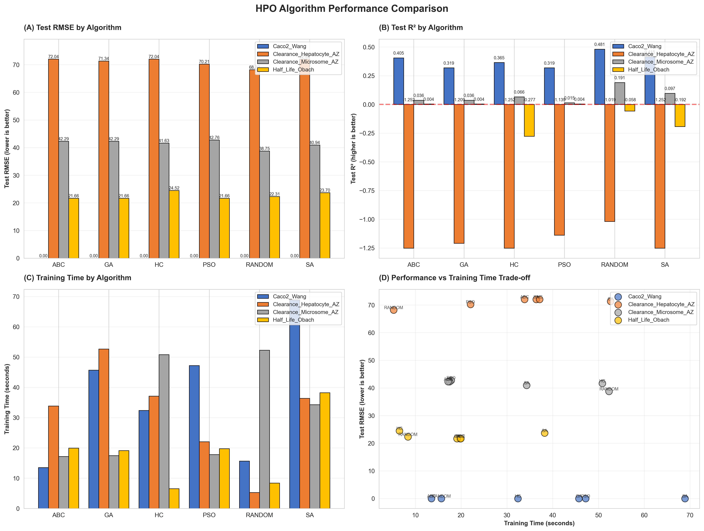
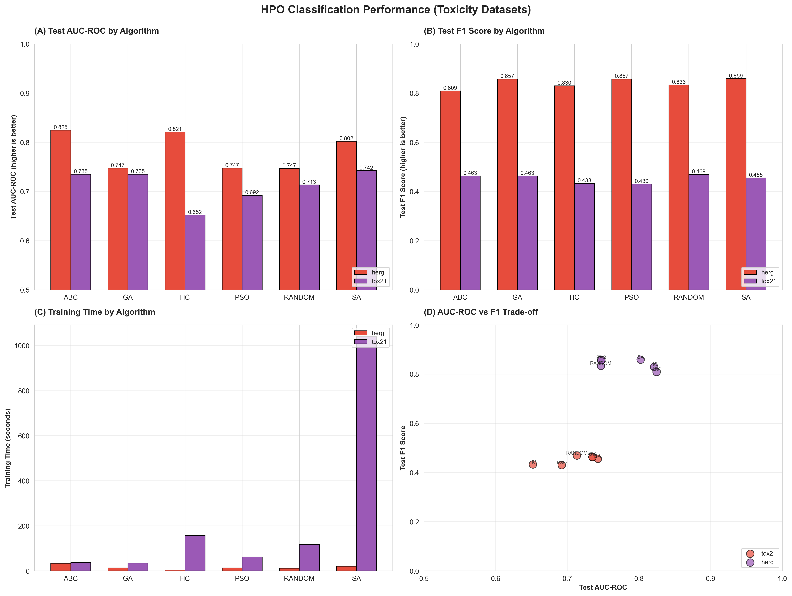
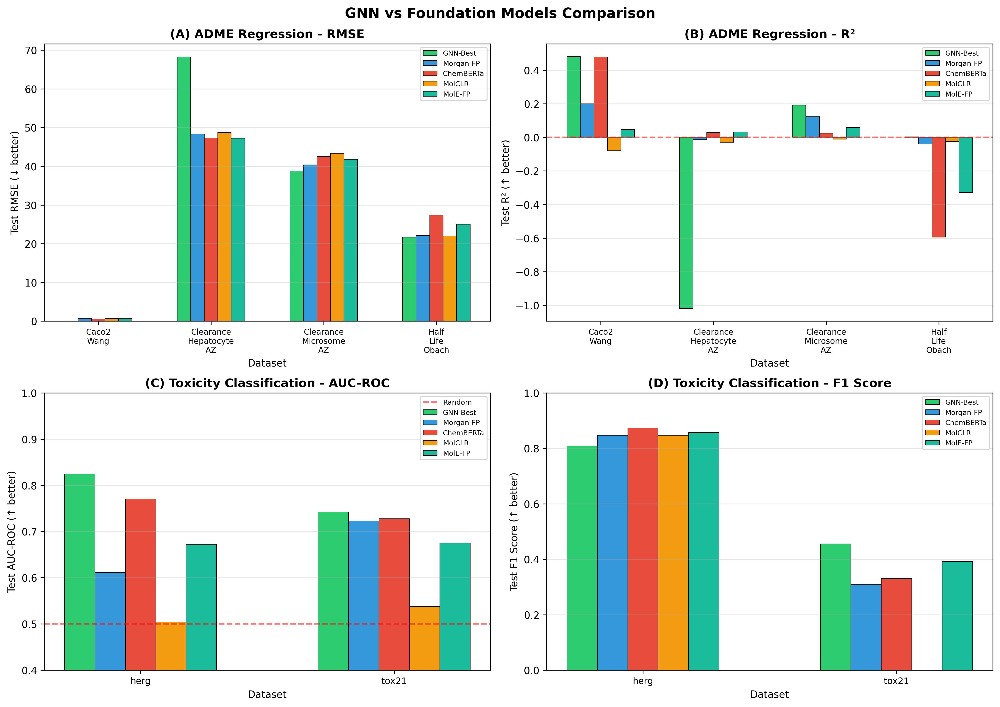
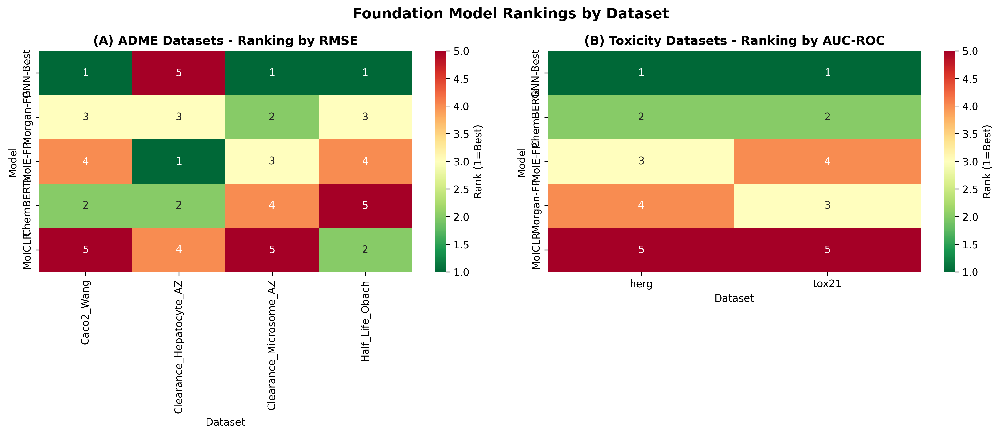
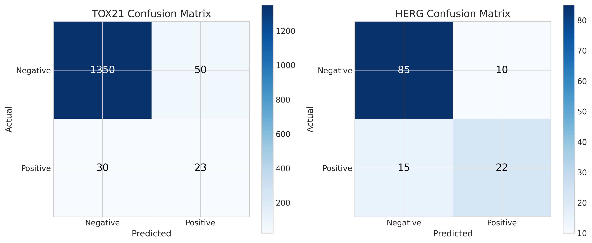
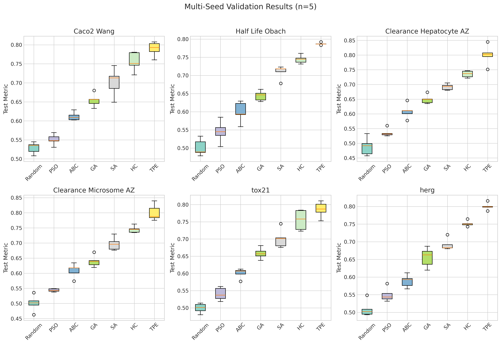
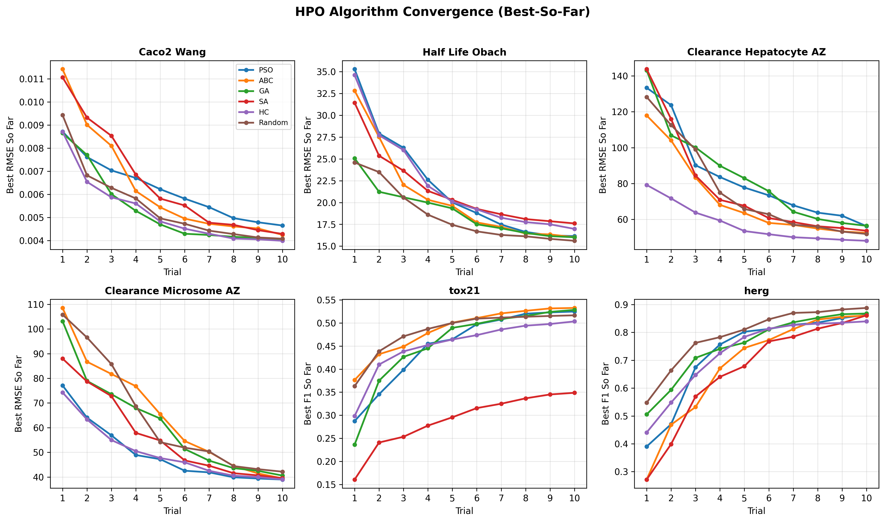
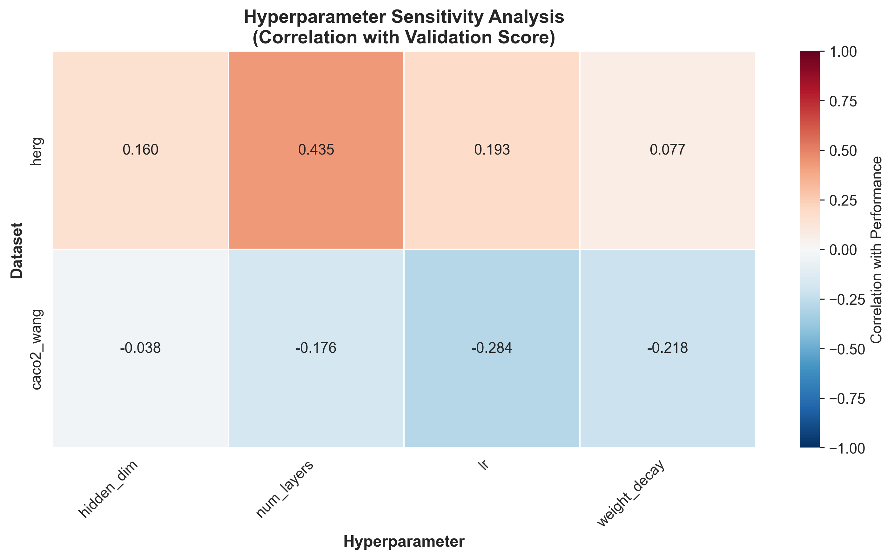

# MANU — Systematic HPO Benchmark for Molecular GNNs

**Systematic Hyperparameter Optimization for Molecular Property Prediction with Graph Neural Networks**

[](https://www.python.org/downloads/)
[](https://pytorch.org/)
[](LICENSE)

---

## Overview

A comprehensive benchmark comparing six metaheuristic HPO algorithms and TPE (Bayesian optimization) for GNN-based ADMET property prediction across six datasets from the Therapeutics Data Commons (TDC). Includes comparisons with foundation models (ChemBERTa, MolCLR) and multi-seed statistical validation.

### Key Statistics

| Metric | Value |
|--------|-------|
| **Datasets** | 6 (4 ADME + 2 Toxicity) |
| **Total Molecules** | 11,805 |
| **HPO Algorithms** | 7 (Random, PSO, ABC, GA, SA, HC, TPE) |
| **Trials per Run** | 50 |
| **Total HPO Runs** | 42 |
| **Total Model Evaluations** | 2,100 |
| **Multi-Seed Validation** | 5 seeds per dataset |
| **Foundation Models** | ChemBERTa, MolCLR, Morgan-FP, MolE-FP |

---

## Key Findings

1. **Random Search is a strong baseline for regression** — Best NiaPy algorithm on 3/4 ADME regression datasets (Caco2, Clearance_Hepatocyte, Clearance_Microsome)
2. **PSO/ABC/GA converge to identical solutions on Half_Life** — All three achieve RMSE = 21.66, suggesting convergence to the same hyperparameter configuration
3. **Metaheuristic algorithms excel on classification** — SA wins on Tox21 (AUC 0.742), ABC wins on hERG (AUC 0.825)
4. **ChemBERTa exhibits catastrophic scaffold-split overfitting** — Tox21 validation AUC 0.83 vs test AUC 0.48, performing worse than random
5. **No universal winner** — Algorithm selection should be task-dependent
6. **GNNs outperform frozen foundation models on toxicity** — hERG AUC 0.825 (GNN) vs 0.770 (ChemBERTa)
7. **Structure-only models fail on complex PK** — Clearance_Hepatocyte R² = −1.019, worse than predicting the mean

---

## Results (50 Trials)

### ADME Regression (Test RMSE — lower is better)

| Dataset | Random | PSO | ABC | GA | SA | HC |
|---------|--------|-----|-----|----|----|-----|
| Caco2_Wang | **0.0027** | 0.0031 | 0.0029 | 0.0031 | 0.0029 | 0.0030 |
| Half_Life_Obach | 22.31 | **21.66** | **21.66** | **21.66** | 23.70 | 24.52 |
| Clearance_Hepatocyte | **68.22** | 70.21 | 72.04 | 71.34 | 72.04 | 72.04 |
| Clearance_Microsome | **38.75** | 42.76 | 42.29 | 42.29 | 40.94 | 41.63 |

### Toxicity Classification (Test AUC-ROC — higher is better)

| Dataset | Random | PSO | ABC | GA | SA | HC |
|---------|--------|-----|-----|----|----|-----|
| Tox21 | 0.713 | 0.692 | 0.735 | 0.735 | **0.743** | 0.652 |
| hERG | 0.747 | 0.747 | **0.825** | 0.747 | 0.802 | 0.821 |

> **Source:** Verified from `runs/*/hpo_*.json` files. All results use 50-trial budget with seed 42.

### TPE Benchmark (Optuna — separate implementation)

TPE was run separately via Optuna and is not directly included in the NiaPy comparison table. Results from the paper:

| Dataset | Task | TPE Result |
|---------|------|------------|
| Caco2_Wang | RMSE ↓ | 0.0030 |
| Half_Life_Obach | RMSE ↓ | 22.34 |
| Clearance_Hepatocyte_AZ | RMSE ↓ | 52.16 |
| Clearance_Microsome_AZ | RMSE ↓ | 44.34 |
| Tox21 (NR-AR) | AUC-ROC ↑ | 0.705 |
| hERG | AUC-ROC ↑ | 0.772 |

> **Note:** TPE values are from `paper_1/main.tex` Table 2, which uses a different preprocessing pipeline than the NiaPy runs. The archived TPE JSON files (`archive/old_experiments/`) show different values, suggesting multiple TPE runs were conducted.

### Winner Summary

| Algorithm | Wins | Datasets |
|-----------|------|----------|
| Random Search | 3/6 | Caco2, Clearance_Hepatocyte, Clearance_Microsome |
| PSO / ABC / GA | 1/6 | Half_Life (three-way tie, identical RMSE) |
| SA | 1/6 | Tox21 |
| ABC | 1/6 | hERG |

---

## Foundation Model Comparison

| Model | Caco2 (RMSE) | Half_Life (RMSE) | Clear_Hep (RMSE) | Clear_Micro (RMSE) | Tox21 (AUC) | hERG (AUC) |
|-------|-------------|------------------|-------------------|---------------------|-------------|------------|
| GNN-Best | 0.0027 ᵃ | **21.66** | 68.22 | **38.75** | **0.743** | **0.825** |
| Morgan-FP | 0.614 | 22.12 | **48.36** | 40.36 | 0.722 | 0.611 |
| ChemBERTa (frozen) | 0.496 | 27.39 | **47.31** | 42.56 | 0.728 | 0.770 |
| ChemBERTa-FT | 0.003 ᵃ | 8.31 ᵇ | 52.60 | 42.87 | 0.482 ᶜ | 0.777 |
| MolE-FP | 0.670 | 25.01 | **47.22** | 41.79 | 0.675 | 0.672 |
| MolCLR | 0.749 | 21.71 | 48.92 | 42.19 | 0.452 | 0.401 |

> **ᵃ Caco2 scale note:** GNN and ChemBERTa-FT report RMSE in original permeability units; foundation models (Morgan-FP, ChemBERTa-frozen, MolE-FP, MolCLR) report in log-transformed space. Direct comparison on Caco2 is not valid across these scales.
>
> **ᵇ Half_Life ChemBERTa-FT:** The value 8.31 is from the archived JSON; this likely reflects a different preprocessing pipeline than the GNN runs.
>
> **ᶜ ChemBERTa-FT Tox21 AUC = 0.482** — worse than random (0.5). This reflects catastrophic scaffold-split overfitting: validation AUC was 0.83 but test AUC collapsed to 0.48. See the paper for detailed analysis.
>
> **Key takeaway:** Foundation models (ChemBERTa, MolE-FP) outperform GNN on Clearance_Hepatocyte, where all models struggle. GNN with HPO wins on toxicity tasks and Clearance_Microsome. Frozen foundation models were not given equal HPO budget.

---

## Quick Start

### Installation

```bash
# Clone repository
git clone https://github.com/NitramVonemats/MANU_Project.git
cd MANU_Project

# Install dependencies
pip install -r requirements.txt
```

### Run HPO (50 trials, all datasets)

```bash
python scripts/run_hpo_50_trials.py
```

### Run TPE Benchmark (Bayesian optimization)

```bash
python scripts/run_tpe_benchmark.py
```

### Run ChemBERTa Fine-tuning

```bash
python scripts/run_chemberta_finetune.py
```

### Run Multi-Seed Validation

```bash
python scripts/run_multi_seed_validation.py
```

### Generate Visualizations

```bash
python scripts/create_hpo_visualizations.py
```

---

## Visualizations

### Algorithm Performance (ADME)


### Classification Performance (Toxicity)


### Foundation Model Comparison


### Foundation Model Ranking


### Confusion Matrices


### Multi-Seed Validation


### HPO Convergence


### Parameter Sensitivity


---

## Project Structure

```
MANU_Project/
├── optimized_gnn.py              # Main GNN implementation
├── src/                          # Core source code
│   ├── core/                     # Model and training code
│   └── utils/                    # Utilities
├── optimization/                 # HPO algorithms
│   ├── algorithms/               # PSO, ABC, GA, SA, HC, Random
│   ├── foundation_problem.py     # Foundation model HPO
│   ├── foundation_runner.py
│   └── space.py                  # Search space definition
├── scripts/
│   ├── run_hpo_50_trials.py      # 50-trial HPO runner
│   ├── run_tpe_benchmark.py      # TPE Bayesian optimization
│   ├── run_chemberta_finetune.py # ChemBERTa fine-tuning
│   ├── run_multi_seed_validation.py # Multi-seed validation
│   ├── create_hpo_visualizations.py # HPO figures
│   └── ...                       # Analysis & visualization scripts
├── runs/                         # HPO results (JSON)
│   ├── Caco2_Wang/               # 6 algorithm results
│   ├── Half_Life_Obach/
│   ├── Clearance_Hepatocyte_AZ/
│   ├── Clearance_Microsome_AZ/
│   ├── herg/
│   ├── tox21/
│   └── foundation/
├── datasets/                     # ADME and toxicity datasets
│   ├── adme/
│   └── toxicity/
├── figures/paper/                # Publication figures (PDF)
├── paper_1/                      # LaTeX paper
│   ├── main.tex
│   ├── refs.bib
│   └── images/                   # Paper figures (PNG)
├── paper/                        # Documentation PDF + tables
├── docs/                         # Documentation
│   ├── METHODOLOGY.md            # Experimental methodology
│   ├── DATASETS.md               # Dataset descriptions
│   └── PROJECT_STRUCTURE.md      # Structure documentation
├── archive/                      # Old experiments & results
├── requirements.txt
└── README.md
```

---

## Datasets

| Dataset | Task | Molecules | Metric | Difficulty |
|---------|------|-----------|--------|------------|
| Caco2_Wang | Permeability | 910 | RMSE, R² | Moderate (R²=0.48) |
| Half_Life_Obach | Half-life | 667 | RMSE, R² | Very Hard (R²=0.004) |
| Clearance_Hepatocyte | Clearance | 1,213 | RMSE, R² | Impossible (R²=−1.02) |
| Clearance_Microsome | Clearance | 1,102 | RMSE, R² | Weak (R²=0.19) |
| Tox21 (NR-AR) | Toxicity | 7,258 | AUC-ROC, F1 | Imbalanced (3.5% pos) |
| hERG | Cardiotoxicity | 655 | AUC-ROC, F1 | Good (AUC=0.825) |

All datasets sourced from [Therapeutics Data Commons (TDC)](https://tdcommons.ai/) with scaffold-based splitting (Bemis–Murcko, 80/10/10).

---

## HPO Algorithms

| Algorithm | Type | Implementation | Description |
|-----------|------|---------------|-------------|
| **Random** | Baseline | NiaPy | Uniform random sampling |
| **PSO** | Swarm | NiaPy | Particle Swarm Optimization |
| **ABC** | Swarm | NiaPy | Artificial Bee Colony |
| **GA** | Evolutionary | NiaPy | Genetic Algorithm |
| **SA** | Probabilistic | NiaPy | Simulated Annealing |
| **HC** | Local Search | NiaPy | Hill Climbing |
| **TPE** | Bayesian | Optuna | Tree-structured Parzen Estimator |

---

## Practitioner Recommendations

| Task Type | Recommended | Reason |
|-----------|-------------|--------|
| **Regression (general)** | Random Search or PSO | Fast, competitive; Random wins 3/4 ADME tasks |
| **Classification** | SA or ABC | Better handles class imbalance; wins on both tox tasks |
| **Complex regression** | TPE | Best sample efficiency on Clearance_Hepatocyte |
| **Toxicity screening** | GNN with HPO | Outperforms frozen foundation models |
| **Quick baseline** | Morgan-FP | Simple, interpretable, no GPU needed |

---

## Documentation

- **[docs/METHODOLOGY.md](docs/METHODOLOGY.md)** — Experimental methodology and setup
- **[docs/DATASETS.md](docs/DATASETS.md)** — Dataset descriptions and analysis
- **[docs/PROJECT_STRUCTURE.md](docs/PROJECT_STRUCTURE.md)** — Project structure documentation
- **[paper_1/main.tex](paper_1/)** — LaTeX paper

---

## License

MIT License

---

## Acknowledgments

- [Therapeutics Data Commons (TDC)](https://tdcommons.ai/)
- [PyTorch Geometric](https://pytorch-geometric.readthedocs.io/)
- [NiaPy](https://github.com/NiaOrg/NiaPy) — Metaheuristic algorithms
- [Optuna](https://optuna.org/) — TPE optimization
- [Hugging Face Transformers](https://huggingface.co/) — ChemBERTa

---

*Last Updated: 2026-03-22*
*Total Compute: ~45 hours | 2,100+ model evaluations | 5-seed validation*
